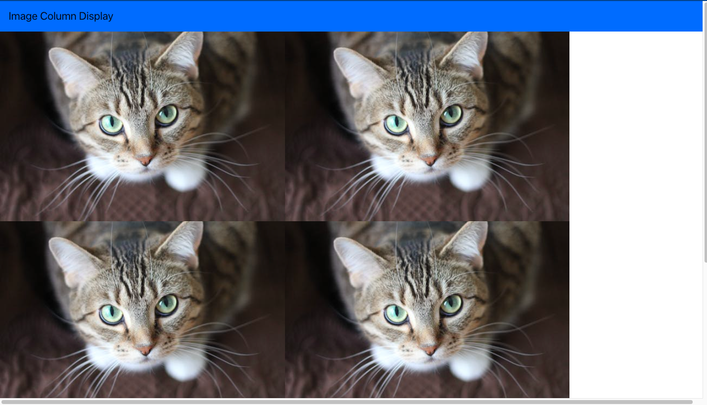
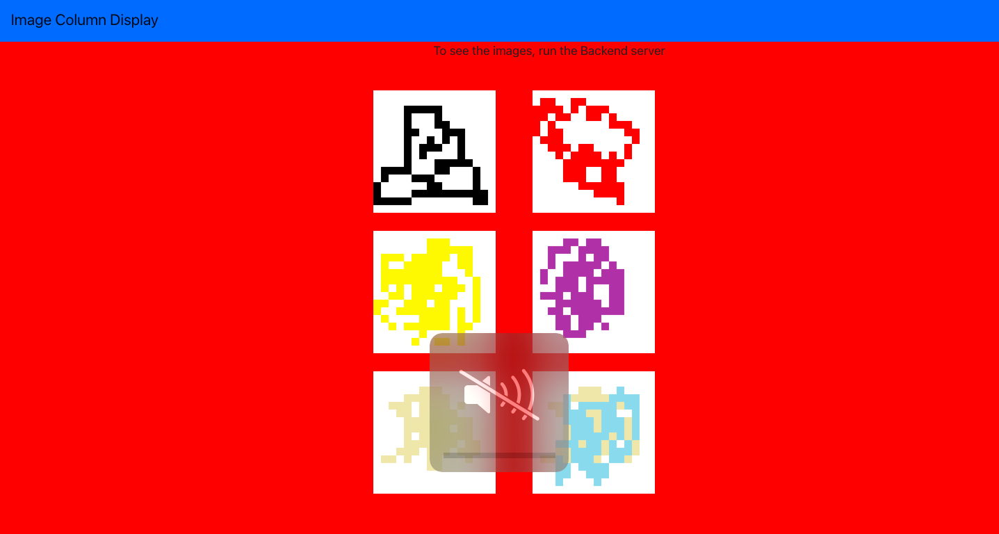

# I Tried

I tried to fetch image from backend to frontend but failed. Instead I fetched an image from API and used bootstrap to display in columns

This is the result I got

## UPDATE

I have been able to fetch images from backend but not quite the way imagined

